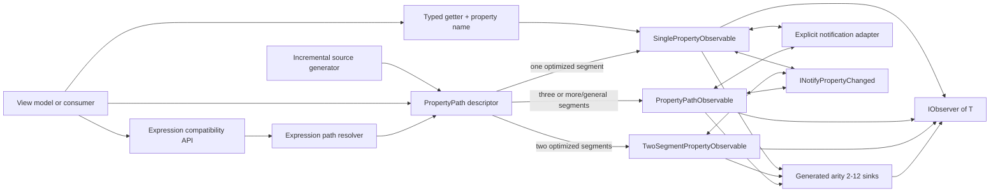

# ProMvvm architecture

This document describes the architecture implemented in ProMvvm `0.1.0-alpha.1`, the performance decisions behind it, and how its typed and expression APIs compare with the `WhenAnyValue` design shipped in ReactiveUI 24.0.0. It documents the current code rather than a proposed end state.

## Scope and design goals

The implemented slice is property observation: turn one or more model properties into cold `IObservable<T>` value streams. ProMvvm is intentionally narrower than ReactiveUI. Its current goals are:

- make the primary API statically typed, reflection-free, trim-safe, and NativeAOT-safe;
- keep the runtime package independent of ReactiveUI, CommunityToolkit.Mvvm, and System.Reactive;
- interoperate through BCL `IObservable<T>` plus either `INotifyPropertyChanged` or an explicitly supplied local notification adapter;
- offer an expression migration surface close to ReactiveUI's `WhenAnyValue` syntax;
- preserve synchronous initial values, nested-chain rewiring, null handling, distinctness, disposal, and error behavior;
- optimize the common single-property path separately from the more general nested path;
- use measured end-to-end performance, not just isolated micro-optimizations, to decide which specializations remain in the implementation.

It is not currently a complete ReactiveUI replacement. In particular, it does not implement ReactiveUI's binding, commands, activation, routing, global notification-provider ecosystem, dynamic/string observation, or before-change observation. The implemented value-observation surface does include selector and tuple overloads through arity 12.

## System shape



The design has four layers:

1. Public overloads select typed, expression, single-property, or multi-property entry points.
2. A property descriptor represents the names used to filter notifications and the getters used to read values.
3. A cold observable creates an isolated subscription state machine for each observer.
4. The state machine attaches directly to `INotifyPropertyChanged` or a call-local adapter and emits through BCL `IObserver<T>`.

There is no scheduler, global service locator, operator pipeline, or framework base-class requirement in this path. Work runs synchronously on the thread that subscribes or raises `PropertyChanged`.

## Public API families

| API | Intended use | Reflection | Trim/NativeAOT contract | Runtime engine |
|---|---|---:|---|---|
| `WhenAnyValue(source, getter, propertyName)` | Fastest one-property call | None | Safe | Specialized single-property sink |
| `WhenAnyValue(source, PropertyPath)` | Reusable or generated typed path | None | Safe | Specialized one/two-segment sink or general path sink |
| `WhenAnyValue(source, expression)` | ReactiveUI-style migration | Metadata parsing; cached one/two-property paths | Marked `RequiresUnreferencedCode` | Same specialized sinks for common shapes; general path sink otherwise |
| 2–12 typed paths plus selector/tuple | AOT-safe multi-property projection | None | Safe | Generated, strongly typed fixed-arity combiner |
| 2–12 expressions plus selector/tuple | Migration multi-property projection | Same expression rules as above | Marked `RequiresUnreferencedCode` | Resolved paths plus the same fixed-arity combiner |
| Any typed/expression form plus adapter | Custom event or observable notification source | No extra reflection | Typed form remains safe | Adapter-specific single/general path sink |

All forms create cold observables. Creating an observable does not attach an event handler. Every `Subscribe` call creates independent state, attaches its own handlers, emits its own initial value, and returns its own disposal boundary.

## Typed descriptor architecture

### Direct typed getter

The direct overload accepts a `Func<TSource,TValue>` and the exact `PropertyChangedEventArgs.PropertyName` to observe:

```csharp
model.WhenAnyValue(
    static value => value.Count,
    nameof(Model.Count));
```

It validates the arguments and constructs `SinglePropertyObservable<TSource,TValue>` directly. This avoids allocating a temporary `PropertyPath`, inspecting a descriptor, using an object-valued segment bridge, or reflecting over the model. It is the lowest-cost end-to-end start path in the current API.

The name is explicit because an ordinary delegate does not carry reliable member metadata. Generated descriptors provide a terse alternative without changing the runtime architecture.

### Generated descriptors

`[GeneratePropertyPaths]` activates an incremental Roslyn generator. For each accessible instance property declared by a non-generic annotated type it emits a sibling `{TypeName}PropertyPaths` class with static, reusable `PropertyPath<TSource,TValue>` fields. It also recognizes fields consumed by CommunityToolkit.Mvvm `[ObservableProperty]` and ReactiveUI.SourceGenerators `[Reactive]`, deriving the property name using those generators' conventional field-name transformation. This is necessary because generators execute independently and cannot rely on another generator's output being visible as syntax input.

Generated fields contain only a constant property name and a static typed getter. They perform no reflection, expression construction, registration, or runtime lookup. The generator is shipped in the runtime NuGet package under `analyzers/dotnet/cs`, while its output becomes ordinary consumer code and introduces no runtime generator dependency. Generic targets currently report `PMVVM001` rather than emitting an incorrectly scoped descriptor type.

### Reusable `PropertyPath`

`PropertyPath<TSource,TValue>` is an immutable descriptor. It contains:

- an `ImmutableArray<IPropertyPathSegment>` for the general chain;
- for a one-segment typed path, the original property name and strongly typed getter in dedicated fields;
- an optional specialized factory for a two-segment chain;
- a `Then` operation that returns a new path with one typed child segment appended.

Each typed segment stores a normal ahead-of-time compiled delegate. The general segment interface exposes `object? GetValue(object instance)`, which allows heterogeneous chains such as `Person -> Address -> string` to live in one immutable array. That generality can box value types. The dedicated single-property fields are therefore not just a lookup shortcut: they let the hottest case bypass the object bridge and keep `TValue` generic from the source getter through the observer.

Paths are safe to cache and reuse across models and subscriptions because they hold only immutable metadata and stateless getters. They do not hold a model, observer, event handler, or last value.

### Dispatch specialization

The typed path overload dispatches before subscription:

- a one-segment path enters `SinglePropertyObservable<TSource,TValue>`;
- a two-segment path enters `TwoSegmentPropertyObservable<TSource,TIntermediate,TValue>`;
- a longer or otherwise general path enters `PropertyPathObservable<TSource,TValue>`.

The two-segment descriptor retains both concrete getter types in its factory, so root replacement and leaf changes never cross the `object`-valued segment interface. The single- and two-segment runtimes do not pay for segment arrays, boxed cached values, watcher arrays, or loop dispatch they cannot use.

## Expression compatibility architecture

The expression API is a compatibility front end over the typed descriptor and subscription engines. It is marked `RequiresUnreferencedCode` at the public boundary because the expression refers to metadata that a trimmer cannot prove must be preserved.

### Parsing and validation

`ExpressionPropertyPath.Create` removes `Convert` and `ConvertChecked` wrappers and accepts a non-empty property or field chain rooted at the lambda parameter. For example, `x => x.Address.City` becomes an ordered root-to-leaf segment list. Calls, constants, unrelated objects, and other non-member shapes are rejected with `ArgumentException` instead of silently producing a stream with different semantics. Conversion nodes are path-shape adapters, not compiled operations: the reflected final value must still be assignment/cast-compatible with `TValue`; arbitrary user-defined or numeric conversion logic is not executed by the path engine.

Properties and fields are supported in the general compatibility path. Notification filtering uses each member's name. A field can be read as part of a chain, although changes still require an owning object to raise `PropertyChanged` with the matching name because fields do not provide notifications themselves.

### Exact single-property fast path

An expression takes the optimized route when it is exactly an instance property on `TSource`, its declared property type is exactly `TValue`, and it has a non-static getter. The resolver then:

1. looks for the `PropertyInfo` in a cache scoped to the closed `<TSource,TValue>` pair;
2. binds the getter once with `MethodInfo.CreateDelegate<Func<TSource,TValue>>()`;
3. creates a single-segment `PropertyPath` carrying that typed getter;
4. feeds the cached path to the same `SinglePropertyObservable` used by typed code.

Consequently, a warmed direct expression performs no reflective property read when a notification arrives. Its steady-state difference from the typed route is mostly entry and resolution overhead; its subscription state machine is the same.

The cache combines a `ConcurrentDictionary<PropertyInfo,CacheEntry>` with an atomic last-entry slot. Repeated use of the same property normally needs one volatile read and reference comparison. The dictionary provides thread-safe lookup and publication when calls alternate between properties or arrive concurrently. Cache growth is bounded by the distinct properties encountered for each closed source/value type pair, not by model or subscription count.

Caching the resolved descriptor cannot remove the expression tree that the caller constructs for each invocation. This is why warmed expression hot start remains more expensive than a reused typed descriptor or direct getter even though notification-time reads use the same bound delegate.

### Exact two-property fast path

A chain exactly shaped like `x => x.Address.City` has its own cache keyed by the root and leaf `PropertyInfo` pair. A last-entry slot handles the usual repeated call site; a concurrent dictionary handles mixed paths and concurrent first use. The cached descriptor targets the same two-segment subscription state machine as a typed `.Then(...)` path. Its getters use `PropertyInfo.GetValue`, because the compatibility API must bridge the runtime intermediate type without dynamic generic construction, but it avoids the general watcher/value arrays and suffix loop.

The non-generic reflected bridge is intentional for trimming diagnostics: it does not use `MakeGenericMethod`, expression compilation, or runtime code generation. The public expression API remains marked `RequiresUnreferencedCode`; the optimization improves its JIT migration path without overstating its AOT contract.

### General reflected path

Longer expressions, field chains, and shapes involving type conversion use `ReflectedPropertyPathSegment` or `ReflectedFieldPathSegment`. Those segments call `PropertyInfo.GetValue` or `FieldInfo.GetValue` when their portion of the chain is rebuilt. They still use the same watcher graph, null rules, distinctness, disposal, and error handling as typed nested paths.

This boundary is intentional:

- the typed API provides the AOT and predictable-performance contract;
- the exact one- and two-property expression fast paths optimize the most common migration calls;
- the reflected fallback preserves useful expression compatibility without pretending to be trim-safe.

A `MethodInvoker`-based alternative for reflected property segments was evaluated during optimization. It did not improve established leaf-change performance and did not produce a reliable rewire win, so the simpler `PropertyInfo.GetValue` implementation was retained.

## Subscription engines

### Single-property state machine

`SinglePropertyObservable<TSource,TValue>` is an immutable cold wrapper around the source, name, getter, distinctness setting, and comparer. `Subscribe` creates a private `Subscription` containing:

- one lock used as the per-subscription serialization gate;
- the source, getter, observer, and comparer;
- an optional `INotifyPropertyChanged` reference;
- one stored `PropertyChangedEventHandler` delegate;
- the last value and a `hasLastValue` flag;
- a stopped flag for idempotent termination and disposal.

Construction attaches the stored handler before the initial read, then publishes under the gate. Attaching first closes the ordinary missed-update window. If an event races with initial publication, both paths serialize through the same gate and default distinctness suppresses a duplicate value.

For each notification, the handler:

1. ignores work after termination;
2. accepts `null` or empty property names as "all properties changed";
3. otherwise compares the name using ordinal equality;
4. invokes the strongly typed getter;
5. applies the configured equality comparer when distinctness is enabled;
6. calls `OnNext` synchronously.

The handler delegate is created once per subscription and reused when detaching. This avoids transient delegate creation on disposal and rewiring and is one of the changes that reduced measured subscription allocation.

If the source does not implement `INotifyPropertyChanged`, the subscription still emits its initial value and then remains silent. A getter failure detaches the handler and reports `OnError`. If `OnNext` throws, the subscription detaches and rethrows the observer exception; it does not convert an observer failure into `OnError`. Disposal is idempotent.

When an adapter is supplied, `AdapterSinglePropertyObservable` replaces the direct event handler with one explicit `IDisposable` subscription. The value, distinctness, locking, error, and disposal semantics remain the same.

### Specialized two-segment state machine

`TwoSegmentPropertyObservable<TSource,TIntermediate,TValue>` stores the root and child as their concrete generic types, two getters, and at most two `INotifyPropertyChanged` references. A leaf event invokes only the typed leaf getter. A root event detaches the previous child, invokes the root getter, attaches the new child, and publishes its leaf. Null intermediates suppress publication while preserving the last emitted value for distinctness continuity.

This state machine is intentionally limited to the direct `INotifyPropertyChanged` route. An explicit adapter can vary by object within a chain, so adapter-backed two-segment paths use the general watcher graph, whose per-level subscriptions express that variability correctly.

### Nested watcher graph

`PropertyPathObservable<TSource,TValue>` allocates its graph once per subscription:

```text
values:   [root, value after segment 0, ..., final value]
watchers: [watch parent for segment 0, ..., watch parent for final segment]
segments: [name/getter 0, ..., name/getter N]
```

Each `Watcher` owns one event-handler delegate and remembers the `INotifyPropertyChanged` instance to which it is currently attached. The graph attaches a watcher to the parent of every segment that supports notifications. A non-notifying parent can still be read; only changes that depend on notifications from that particular parent cannot be detected. Deeper notifying objects are still observed after the initial chain is resolved.

With an explicit adapter, each watcher instead owns the `IDisposable` returned for its current parent. This allows one local `FirstSupported` adapter to select different notification mechanisms at different levels. No adapter is globally registered, cached by source type, or obtained from a service locator.

Initial subscription runs `RebuildAndPublish(0, 0)`. For every segment it attaches to the parent before invoking the segment getter, stores the child in `_values`, and proceeds. When the entire chain is valid, it publishes the final value synchronously.

### Incremental leaf changes and rewiring

An event includes the watcher/segment index that received it. The runtime keeps the prefix before that segment and rebuilds only the affected suffix:

1. filter the event against that segment's property name;
2. detach watchers strictly downstream of the notifying segment;
3. reread the changed segment from its cached parent;
4. traverse the new suffix, attaching each downstream watcher before reading its child;
5. publish the new final value if the chain is valid and the final distinct check accepts it.

A leaf notification therefore performs one leaf getter and no handler rewiring. Replacing an intermediate object detaches only the obsolete branch and attaches only the new branch. The root and unaffected prefix remain cached.

This prefix/suffix design is the main reason nested rewire is inexpensive relative to rebuilding an expression-observation pipeline. It also guarantees that changes on an old detached child no longer reach the observer.

### Null semantics

An intermediate `null` invalidates the remainder of the path. Downstream handlers and cached values are cleared, and no value is emitted. When a later parent notification restores the chain, the suffix is rebuilt and observation resumes.

A `null` final value is different: the chain is valid, so `null` is emitted as a real value. The last emitted final value is retained while a chain is invalid. If the chain later becomes valid with the same final value, default distinctness suppresses it. This gives distinctness continuity across temporary null intermediates.

### Generated multi-property combination

Selector and tuple APIs exist for arities 2 through 12 in both typed-path and expression forms, with corresponding explicit-adapter forms. Arity 2 is kept as checked-in source for the bootstrap surface; one incremental-generator template emits arities 3–12 into the ProMvvm runtime compilation. The same generator therefore owns overload signatures and sink layout, preventing handwritten arities from drifting.

Every arity has a closed `CombineLatestObservable<T1,...,TN,TResult>` implementation. Its subscription stores each latest value in a typed field, one presence flag per input, the last result, one disposable per upstream, and a single gate. Each upstream gets a dedicated generic observer such as `SourceObserver7`; no notification index, `object[]`, boxed value, params array, or general operator pipeline appears on the update path.

Inputs are connected in order and synchronously provide their initial values. The selector first runs when every presence flag is set. Later changes replace one typed slot and project from the latest set. Distinctness is applied to each property input and to the projected result. A custom comparer supplied to the multi-property overload applies to the result; inputs use their default type comparers.

Selector or upstream errors stop the combiner and dispose every connected input. An exception from the final observer also stops and disposes the combiner before propagating. Source completion is ignored because property observation itself is an open-ended event stream. These rules are shared by the handwritten arity-2 and generated higher-arity state machines.

The fixed-arity design deliberately trades generated code size for predictable hot-path layout. At arity 12 it performs all twelve synchronous source updates without per-update boxing and retains the runtime package's lack of a System.Reactive dependency.

## Explicit notification adapters

`IPropertyNotificationAdapter` has one operation: attempt to subscribe an object to property-name callbacks and return an `IDisposable`, or return `null` when the object is unsupported. The adapter is passed at the call site and captured only by that observable. There is no mutable registry, ambient provider, dependency-injection requirement, or service locator.

`PropertyNotificationAdapters` supplies three composition tools:

- `Create<TSource>` wraps any typed event subscription;
- `FromObservable<TSource>` wraps an `IObservable<string?>` change-name stream without adding a System.Reactive dependency;
- `FirstSupported` tries immutable adapter instances in caller-defined order, which enables mixed nested chains.

Direct INPC observation remains the default and fastest route. `PropertyNotificationAdapters.Inpc` exists when callers need INPC to participate explicitly in a mixed adapter chain. Adapter callbacks use the same property-name filtering (`null` and empty mean all properties), serialized subscription state, synchronous value reads, distinctness, terminal error behavior, and deterministic disposal as direct observation. Synchronous callbacks raised by an adapter during attachment are suppressed; the immediately following initial read publishes the authoritative current value.

## Concurrency, reentrancy, and lifetime rules

State is never shared between subscriptions. Every single, nested, and combined subscription has its own gate and last-value state. This gives these guarantees:

- concurrent events for one subscription are serialized;
- notification name filtering, reads, rewiring, distinctness, and observer calls occur in one ordered critical section;
- disposal cannot interleave halfway through a rebuild;
- locks are reentrant for same-thread model changes caused by an observer;
- terminal getter/selector errors and disposal prevent subsequent notifications;
- event handlers are detached on disposal and terminal engine errors.

Observer callbacks execute while the subscription gate is held. This makes state transitions simple and deterministic, but observers should avoid long blocking work and cross-thread lock cycles. Consumers that need a delivery scheduler can compose the returned BCL observable with System.Reactive's `ObserveOn` without making it a ProMvvm runtime dependency.

The cold observable itself retains its source. Disposing a subscription releases event-handler relationships but does not make a separately retained observable release the source; consumers should release unused observable instances as they would any object holding a model reference.

## Performance architecture

The optimization sequence concentrated cost where the benchmark matrix showed it mattered:

- **Separate the single-property engine.** It removes watcher/value arrays, segment dispatch, and value boxing from the dominant case.
- **Add the direct getter overload.** It removes descriptor construction and dispatch from one-property hot start.
- **Retain typed getter metadata in a single path.** A reusable typed path reaches the same specialized engine instead of falling back to the general path representation.
- **Bind exact expression getters once.** `CreateDelegate` eliminates reflective reads from warmed direct-expression notifications.
- **Add a last-entry expression cache.** Repeated observation of one property avoids a dictionary lookup while retaining concurrent correctness for mixed properties.
- **Reuse event-handler delegates.** Subscription teardown and nested rewiring no longer recreate method-group delegates.
- **Cache the resolved nested prefix.** A leaf change reads only the leaf; an intermediate replacement rebuilds only its suffix.
- **Specialize two-segment paths.** Concrete root, intermediate, and leaf types remove arrays, boxing, and virtual segment dispatch from the dominant nested shape.
- **Cache exact two-property expressions.** Warm expression paths reuse the specialized shape without dynamic generic construction.
- **Generate fixed-arity sinks.** Multi-property projection through arity 12 uses typed fields and source observers rather than arrays, boxing, or a general operator pipeline.
- **Reject optimizations that do not improve end-to-end measurements.** The reflected `MethodInvoker` experiment was removed after it failed to improve the relevant nested benchmarks.

The following verified results use BenchmarkDotNet 0.15.8, .NET 10.0.5, ReactiveUI 24.0.0, Release builds, and the same hand-written notification models and observer shape on an Apple M3 Pro. Allocation includes work performed by the benchmark model when it raises an event, not just the observation sink.

| Scenario | ProMvvm typed | ProMvvm expression | ReactiveUI core | ReactiveUI.Reactive |
|---|---:|---:|---:|---:|
| Cold construction | 7.580 ns / 56 B (path); 6.596 ns / 56 B (getter) | 191.180 ns / 616 B | 214.658 ns / 712 B | 214.934 ns / 712 B |
| Hot start | 41.51 ns / 232 B (path); 33.15 ns / 176 B (getter); 41.45 ns / 232 B (generated) | 218.75 ns / 792 B | 325.76 ns / 1,440 B | 327.12 ns / 1,440 B |
| Subscribe, initial value, dispose | 35.37 ns / 176 B | 38.31 ns / 176 B | 126.97 ns / 728 B | 132.56 ns / 728 B |
| Single emission | 8.783 ns / 24 B | 11.264 ns / 24 B | 29.214 ns / 88 B | 29.234 ns / 88 B |
| Burst: 1 change | 9.565 ns / 24 B | 11.200 ns / 24 B | 24.933 ns / 48 B | 25.083 ns / 48 B |
| Burst: 100 changes | 0.974 us / 2,400 B | 1.173 us / 2,400 B | 3.035 us / 8,800 B | 2.929 us / 8,800 B |
| Burst: 10,000 changes | 99.014 us / 240,000 B | 117.010 us / 240,000 B | 293.277 us / 880,000 B | 292.396 us / 880,000 B |
| Two-property selector | 23.75 ns / 24 B | 25.35 ns / 24 B | 47.71 ns / 88 B | 47.53 ns / 88 B |
| Twelve-property selector | 206.7 ns / 24 B | 226.9 ns / 24 B | 552.3 ns / 792 B | 553.8 ns / 792 B |
| Twelve-property hot start | 1.220 us / 5.95 KB | 3.457 us / 12.51 KB | 4.773 us / 21.95 KB | 4.859 us / 21.95 KB |
| Nested leaf change | 9.940 ns / 24 B | 19.166 ns / 48 B | 31.295 ns / 88 B | 31.174 ns / 88 B |
| Nested rewire | 17.67 ns / 24 B | 29.50 ns / 48 B | 102.61 ns / 376 B | 106.67 ns / 376 B |

"Hot start" here means a warmed JIT and warmed expression-path cache while still measuring observable construction, expression-tree construction where applicable, subscription, synchronous initial delivery, disposal, and all resulting allocation. It does not mean a shared or already-connected hot observable.

The explicit-INPC adapter benchmark measures 8.330 ns / 24 B per emission versus 8.344 ns / 24 B for the direct INPC path. The difference is below measurement significance: the adapter adds an indirection at setup, but its steady-state callback reaches the same name filter and typed getter without allocating.

The results align with the architecture:

- typed getter hot start is fastest because it constructs only the specialized observable and subscription;
- typed path and typed getter converge once subscribed because both use the same single sink;
- warmed direct expressions get close to typed subscription/emission cost because they also reach that sink;
- expression construction and hot start retain expression-tree and resolver costs that caching cannot erase;
- typed two-segment paths now stay fully generic, while warmed two-property expressions share their compact state machine but retain reflective getters;
- a generated descriptor is performance-equivalent to its handwritten typed descriptor because both are the same runtime object shape;
- fixed-arity sinks preserve 24-byte model-notification allocation even at arity 12, while the compared ReactiveUI calls allocate 792 bytes;
- both ReactiveUI distributions have nearly identical steady-state results because their benchmarked APIs share the same broader observation design.

The complete benchmark definitions, measurement rules, commands, and current results are maintained in [the benchmark guide](../benchmarks/README.md).

## ReactiveUI 24 design comparison

This comparison is based on the `ReactiveUI` and `ReactiveUI.Reactive` 24.0.0 assemblies actually referenced by the benchmark project. It compares the benchmarked expression `WhenAnyValue` surface, not every feature in ReactiveUI.

### ReactiveUI observation flow

For an expression call, ReactiveUI's `WhenAnyValue` flows through `WhenAny`, `ObservableForProperty`, and its expression-chain machinery. Its `ExpressionChainSink` maintains a gate, per-level state and subscriptions, cached last-value/distinctness state, and protection against a notification racing the initial "kicker" read. `CompiledPropertyChain` supplies cached accessors, while the observable-for-property layer selects a notification provider. The pipeline emits `IObservedChange<TSender,TValue>` records, and `WhenAnyValue` selects each record's `Value` for its caller.

ReactiveUI also ships generated specialized `WhenAnyValueSink` and `WhenAnyChangeSink` implementations through arity 12. Its machinery supports capabilities that ProMvvm's value-only sinks do not need to carry: sender/expression metadata, string and dynamic paths, provider selection, initial-value controls, warning suppression, and infrastructure used by before-change observation.

That breadth explains an important design difference. ProMvvm starts with the narrow value stream it wants to expose, attaches directly to `INotifyPropertyChanged`, and stores only names, getters, cached values, and handlers. ReactiveUI routes observation through a reusable framework abstraction that supports more source types and richer observed-change semantics.

### Feature and implementation matrix

| Dimension | ProMvvm typed | ProMvvm expression | ReactiveUI 24 core (`ReactiveUI`) | ReactiveUI 24 System.Reactive (`ReactiveUI.Reactive`) |
|---|---|---|---|---|
| Primary descriptor | Explicit or generated name + typed delegate | `Expression<Func<...>>` resolved to a path | Expression/string chain | Expression/string chain |
| Direct-property steady-state read | Typed delegate | Cached typed delegate | Cached/compiled chain accessor | Cached/compiled chain accessor |
| Two-segment read | Specialized typed getters | Cached specialized shape with reflected getters | Compiled property-chain machinery | Compiled property-chain machinery |
| General nested read | Typed segment delegates through object bridge | Reflected member segments | Compiled property-chain machinery | Compiled property-chain machinery |
| Emitted internal shape | `TValue` | `TValue` | Observed-change infrastructure, then `TValue` | Observed-change infrastructure, then `TValue` |
| Notification source | Direct INPC or explicit local adapter | Direct INPC or explicit local adapter | Pluggable observable-for-property providers | Pluggable observable-for-property providers |
| Synchronous initial value | Yes | Yes | Yes for benchmarked call | Yes for benchmarked call |
| Cold, independent subscriptions | Yes | Yes | Yes | Yes |
| Nested rewiring | Yes, cached prefix/suffix rebuild | Yes, same graph | Yes, expression-chain levels | Yes, expression-chain levels |
| Intermediate-null behavior | Suppress until valid | Same | Supported by broader chain/warning behavior | Supported by broader chain/warning behavior |
| Final distinctness | Default; configurable comparer or disabled | Same | `WhenAnyValue` value semantics | `WhenAnyValue` value semantics |
| Multi-property arity | Generated through 12 | Generated through 12 | Generated through 12 | Generated through 12 |
| String/dynamic observation | No | No | Yes | Yes |
| Before-change infrastructure | No | No | Available through broader ReactiveUI APIs | Available through broader ReactiveUI APIs |
| Global/provider configuration | None; adapters are call-local | None; adapters are call-local | Participates in ReactiveUI builder/services | Participates in ReactiveUI.Reactive builder/services |
| System.Reactive runtime dependency | None | None | None in the optimized core distribution | Yes |
| Trim/NativeAOT position | Primary supported path | `RequiresUnreferencedCode` migration path | Benchmarked expression API is `RequiresUnreferencedCode` | Benchmarked expression API is `RequiresUnreferencedCode` |
| Framework base class required by ProMvvm | No | No | Not applicable | Not applicable |
| Intended tradeoff | Smallest and most predictable engine | Familiar syntax with compatibility cost | Broader observation abstraction without System.Reactive dependency | Broader observation abstraction plus System.Reactive integration |

ReactiveUI has source-generation capabilities beyond the hand-written expression API used in these benchmarks. Those alternatives should be measured separately before making claims about them; the current table and numbers compare equivalent runtime expression calls in core and `.Reactive` packages.

### Core versus `.Reactive`

The benchmark includes both distributions because `ReactiveUI.Reactive` should not be treated as the only ReactiveUI 24 implementation:

- `ReactiveUI` is the newer optimized core distribution and avoids a System.Reactive package dependency for this API surface;
- `ReactiveUI.Reactive` adds the System.Reactive-compatible distribution and depends on System.Reactive 7;
- each is initialized through its corresponding builder namespace in the benchmark;
- their expression `WhenAnyValue` architecture and measured costs are close, with neither producing a material steady-state advantage in the current matrix.

ProMvvm differs from both: it exposes only BCL `IObservable<T>` in its package, yet consumers can apply System.Reactive operators when System.Reactive is present in the application.

## Framework interoperability

ProMvvm observes behavior, not ancestry. A source only needs to be a class; changes are observed through INPC by default or through a call-local adapter. This lets the same runtime work with:

- a hand-written model;
- CommunityToolkit.Mvvm generated `[ObservableProperty]` members;
- ReactiveUI.SourceGenerators generated `[Reactive]` members on a ReactiveUI object;
- any other model that raises compatible property notifications;
- models with custom events or observable change-name streams through explicit adapters.

The integration tests compile and execute both CommunityToolkit and ReactiveUI source-generator models, including ProMvvm descriptors generated from their annotated backing fields. The ReactiveUI integration also runs a ProMvvm observation and a ReactiveUI.Reactive observation on the same instance, demonstrating that the libraries can coexist during migration. Namespace aliases or the explicit typed getter overload avoid extension-method ambiguity at mixed call sites.

## Trimming and NativeAOT boundary

The runtime project targets .NET 10, enables the trim analyzer, declares itself trimmable and AOT-compatible, and has no runtime package references. The typed API contains only ordinary generic code, delegates, BCL collection types, and event subscriptions. The source generator is a build-time analyzer. The smoke project exercises generated descriptors, typed single and specialized nested paths, rewiring, arity 12, and a custom notification adapter. CI publishes and runs it with full trimming and NativeAOT on Linux x64, Windows x64, and macOS Arm64.

The expression API is not part of that guarantee. Marking it `RequiresUnreferencedCode` makes the boundary visible to callers and analyzers. Applications can use it for migration in ordinary JIT deployments and move performance- or AOT-critical sites to typed descriptors without changing downstream observer code.

## Behavioral invariants covered by tests

The unit suite verifies the architecture's externally visible invariants:

- coldness, synchronous initial delivery, and independent subscriptions;
- exact, empty, and null property-name notifications;
- default, custom, and disabled distinctness;
- sources that do not implement `INotifyPropertyChanged`;
- getter, selector, source, and observer failure paths;
- nested leaf updates, intermediate replacement, old-branch detachment, null suppression, final-null emission, and disposal;
- reentrant notifications and per-subscription serialization;
- property, nested, field, and conversion expression shapes plus invalid-expression rejection;
- concurrent expression-cache use;
- parallel notification serialization and concurrent subscribe/dispose stress;
- selector and tuple behavior at every typed arity plus expression and adapter boundaries at arity 12;
- custom-event, observable-stream, composed mixed-chain, and synchronous-callback adapters;
- generator output for ordinary, CommunityToolkit, and ReactiveUI properties plus diagnostic behavior.

Release test settings enforce 100% line and method coverage and at least 98% branch coverage for the runtime unit-test target. Generator tests and integration tests separately validate compile-time output and the two external source-generator ecosystems. Coverage is evidence that the branches were exercised; the invariants above remain the architectural contract.

## Source map

- [`WhenAnyValueExtensions.cs`](../src/ProMvvm/WhenAnyValueExtensions.cs) selects the single typed, path, and expression entry points.
- [`WhenAnyValueExtensions.Multi.cs`](../src/ProMvvm/WhenAnyValueExtensions.Multi.cs) bootstraps the arity-2 selector and tuple APIs.
- [`ProMvvmGenerator.cs`](../src/ProMvvm.SourceGenerators/ProMvvmGenerator.cs) emits arity 3–12 overloads and sinks plus consumer property descriptors.
- [`PropertyPath.cs`](../src/ProMvvm/PropertyPath.cs) and [`PropertyPathFactory.cs`](../src/ProMvvm/PropertyPathFactory.cs) implement immutable typed descriptors.
- [`ExpressionPropertyPath.cs`](../src/ProMvvm/ExpressionPropertyPath.cs) parses compatibility expressions and owns the exact-property cache.
- [`SinglePropertyObservable.cs`](../src/ProMvvm/SinglePropertyObservable.cs) is the specialized typed single-property state machine.
- [`TwoSegmentPropertyObservable.cs`](../src/ProMvvm/TwoSegmentPropertyObservable.cs) is the specialized typed two-segment state machine.
- [`PropertyPathObservable.cs`](../src/ProMvvm/PropertyPathObservable.cs) is the general cached watcher graph.
- [`CombineLatestObservable.cs`](../src/ProMvvm/CombineLatestObservable.cs) is the arity-2 projection state machine; generated siblings cover arities 3–12.
- [`PropertyNotificationAdapters.cs`](../src/ProMvvm/PropertyNotificationAdapters.cs) defines explicit adapter construction and composition.
- [Unit tests](../tests/ProMvvm.Tests) specify engine behavior; [generator tests](../tests/ProMvvm.SourceGenerators.Tests) specify emitted code; [integration tests](../tests/ProMvvm.IntegrationTests) specify ecosystem compatibility.
- [Benchmarks](../benchmarks/ProMvvm.Benchmarks) and their [results guide](../benchmarks/README.md) define the performance comparison.

## Current extension points and constraints

The architecture leaves clear paths for future work without weakening the typed core:

- support generated descriptors for generic and inherited model shapes with unambiguous generated naming;
- specialize additional nested lengths only where measurements justify the generic code-size cost;
- add adapter-specific setup/hot-start benchmarks and optional typed adapter contracts if setup becomes material;
- benchmark ReactiveUI source-generated observation separately from its expression surface;
- add mobile/browser platform execution as .NET 10 runners and NativeAOT support permit;
- evaluate incremental generator size and compile-time cost as more compatibility APIs are added.

Any extension should preserve the central separation: typed descriptors define the supported AOT/performance path, expression parsing remains an explicit migration boundary, and subscription state remains isolated, cold, deterministic, and directly disposable.
